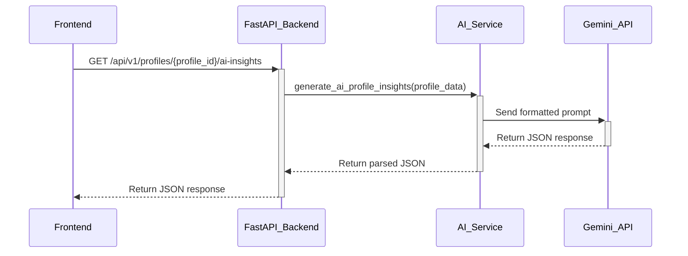

# Technical Plan: AI-Powered Profile Insights

This document outlines the technical plan for replacing the current rule-based profile insights feature with a true AI-powered system.

## 1. Technology Selection

**Recommended LLM Service:** Google's Gemini API

**Rationale:**

*   **Cost-Effectiveness:** Gemini offers a generous free tier and competitive pricing, which is ideal for startups and projects with variable workloads.
*   **Performance and Multimodality:** Gemini models are known for their strong performance in understanding and processing nuanced text. Its native multimodality also offers future-proofing for analyzing images and videos.
*   **Ease of Integration:** Google provides a well-documented Python client library (`google-generativeai`), making it straightforward to integrate with our existing FastAPI backend.
*   **JSON Mode:** The Gemini API supports a JSON mode, which guarantees that the output is valid JSON, ensuring reliable parsing of the structured insights.

## 2. Backend Architecture

### New Python Module: `backend/ai_service.py`

A new module will be created to handle all interactions with the Gemini API.

**`backend/ai_service.py`:**

```python
import os
import google.generativeai as genai
from dotenv import load_dotenv
import json

# Load environment variables
load_dotenv()

# Configure the Gemini API key
api_key = os.getenv("GEMINI_API_KEY")
if not api_key:
    raise ValueError("GEMINI_API_KEY not found in environment variables.")
genai.configure(api_key=api_key)

# Initialize the generative model
model = genai.GenerativeModel('gemini-1.5-flash')

def generate_ai_profile_insights(profile_data: dict) -> dict:
    """
    Generates AI-powered insights for a user profile using the Gemini API.
    """
    prompt = create_prompt(profile_data)

    try:
        response = model.generate_content(
            prompt,
            generation_config=genai.types.GenerationConfig(
                response_mime_type="application/json"
            )
        )
        return json.loads(response.text)
    except Exception as e:
        print(f"Error generating AI insights: {e}")
        return {
            "error": "Failed to generate AI insights.",
            "details": str(e)
        }

def create_prompt(profile_data: dict) -> str:
    """
    Creates the prompt to be sent to the LLM.
    """
    # (Prompt content from Section 3)
    prompt = f"""
You are an AI casting director and career advisor for actors. Your task is to analyze the provided actor profile and generate a JSON object with personalized insights.

**Instructions:**

1.  **Analyze the Profile:** Carefully review the following actor profile data:
    ```json
    {json.dumps(profile_data)}
    ```

2.  **Generate Insights:** Based on the profile, provide the following insights in a JSON object with the specified structure.

    *   **`lookalikes`**: Suggest 3 well-known actors the user might be compared to.
    *   **`scripts`**: Recommend 3 specific monologues or scenes.
    *   **`headshots`**: Provide 3 actionable tips for their next headshot session.
    *   **`careerAdvice`**: Offer 3 pieces of personalized career advice.

3.  **Output Format:** The final output must be a valid JSON object.
    """
    return prompt
```

### Secure API Key Management

The `GEMINI_API_KEY` will be stored in `backend/.env`.

**`backend/.env`:**

```
GEMINI_API_KEY="your-gemini-api-key-here"```

### Modifications to `backend/main.py`

The `generate_profile_ai_insights` function will be updated to call the new service.

**`backend/main.py` Changes:**

1.  **Import the new service:**
    ```python
    from backend.ai_service import generate_ai_profile_insights as generate_insights_from_ai
    ```
2.  **Update the endpoint:**
    ```python
    @app.get("/api/v1/profiles/{profile_id}/ai-insights")
    async def get_profile_ai_insights(profile_id: str, current_user: UserResponse = Depends(get_current_user)):
        db = get_db()
        profile = get_profile_by_id(db, profile_id)
        # ... (error handling)
        insights = generate_insights_from_ai(profile)
        return insights
    ```

## 3. Prompt Engineering

The prompt in `backend/ai_service.py` will instruct the LLM to act as an AI casting director and generate a JSON object with personalized insights for lookalikes, scripts, headshots, and career advice.

## 4. Data Flow



## 5. Frontend Considerations

*   **API Integration:** Add a new function in `frontend/src/utils/api.ts` to fetch insights.
*   **State Management:** Manage loading and error states in `frontend/src/pages/Profile.tsx`.
*   **UI Components:** Create a new component to display the insights and a button to trigger the fetch.
*   **Dynamic Content:** Ensure the UI is flexible to handle AI-generated content.

This plan provides a clear path for a developer to implement the new AI-powered profile insights feature.