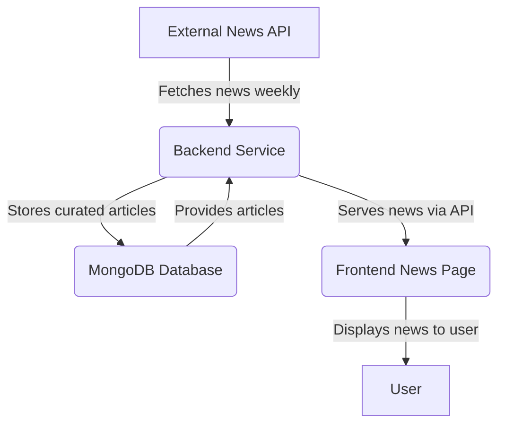

# Industry News Page - Architecture Plan

This document outlines the architecture and development plan for the new Industry News page.

## 1. High-Level Architecture

The system will consist of four main components: an external News API, our backend, the database, and the frontend.

## 2. Component Breakdown

### A. External News API

*   **Responsibility:** Provide access to news articles from various sources.
*   **Requirements:**
    *   Must have a free or affordable plan for development and initial launch.
    *   Should provide access to major film and entertainment news sources.
    *   API should be reliable and well-documented.
*   **Action Item:** Research and select a suitable News API.

### B. Backend Service (FastAPI)

*   **Responsibilities:**
    1.  **Scheduled News Fetching:** A background task will run weekly to fetch the latest news from the external News API.
    2.  **News Curation:** The service will process the fetched articles, filtering for relevant keywords like "acting," "actor," "film industry," etc.
    3.  **Database Storage:** The curated articles will be stored in our MongoDB database.
    4.  **API Endpoint:** A new API endpoint will be created to serve the news articles to the frontend.

### C. MongoDB Database

*   **Responsibility:** Store the curated news articles.
*   **Schema:** A new collection named `news_articles` will be created with a unique index on the `url` field to prevent duplicates.

    *   `title`: string (Required) - The headline of the article.
    *   `source`: string (Required) - The original publisher of the article (e.g., "Variety").
    *   `url`: string (Required, Unique) - The direct URL to the original article.
    *   `published_at`: datetime (Required) - The date and time the article was published.
    *   `summary`: string (Required) - A brief summary or description of the article.
    *   `image_url`: string (Optional) - A URL to a relevant image for the article.
    *   `category`: string (Indexed) - The category of the news (e.g., "Casting News", "Industry Trends", "Film Releases").
    *   `fetched_at`: datetime (Default: now) - The timestamp of when the article was fetched by our service.

### D. Frontend News Page (React)

*   **Responsibility:** Display the news articles to the user in a clean and organized manner.
*   **Features:**
    *   A dedicated page at the `/news` route.
    *   A professional layout with a list of articles, each showing the title, source, summary, and an image.
    *   Clicking on an article will open the original source in a new tab.
    *   Categorization or filtering options to allow users to find relevant news easily.
    *   A "Featured Article" section at the top of the page.
    *   A loading state to provide feedback to the user while news is being fetched.
    *   Responsive design for mobile and desktop.

## 3. Technology Stack

*   **Backend:** FastAPI, Python
*   **Database:** MongoDB
*   **Frontend:** React, TypeScript
*   **Scheduling:** A simple background task runner compatible with FastAPI (e.g., `fastapi-utils`).

## 4. User Experience (UX)

The news page should be designed to be a valuable resource for actors. The layout should be clean and easy to read, with a focus on scannability. We'll use cards to display each article, and we'll consider adding a "Featured Article" section at the top.

---

This architecture provides a solid foundation for the new feature. The next step is to research and select a News API.